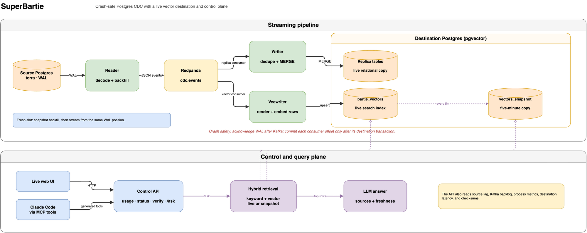

# Super Bartie

Super Bartie is a follow-up to [Bartie](https://github.com/BABTUNA/Bartie), a small Postgres CDC engine I built to understand how [Artie](https://artie.com) works. Bartie reads a Postgres write-ahead log and keeps a copy of the tables in a second database. It ran from a terminal.

This repo keeps that engine as it was and adds the parts around it: an API for checking on the pipeline, a second destination that stores vectors, an MCP server, and a deployment.

```text
source Postgres ──WAL──▶ reader ──▶ Redpanda ──┬──▶ writer ────▶ destination Postgres (tables)
                                               └──▶ vecwriter ─▶ destination Postgres (pgvector)
                                                                        ▲
                                     api: usage, error logs, verify, /ask, demo pokes
```

The source data is Artie's own [terra](https://github.com/artie-labs/terra) demo dataset, run unmodified. The reader, writer, backfill, and verify come from Bartie and are covered in that repo. What this repo adds is in the "Control api, vector destination, MCP" section below.

### ▶ Live

The pipeline is running at [babtuna.vercel.app/super-bartie/live](https://babtuna.vercel.app/super-bartie/live). You can watch rows get replicated, change a row, ask a question against a live copy and a five-minute-old snapshot, and run a checksum of every table. [babtuna.vercel.app/super-bartie/data](https://babtuna.vercel.app/super-bartie/data) shows both databases next to each other. Both pages call the api described below.

### ▶ Demo video

<p align="center">
  <a href="https://www.youtube.com/watch?v=zmyBYuo_dT8">
    
  </a>
</p>

The engine underneath has its own walkthrough: [Bartie demo](https://www.youtube.com/watch?v=FJlTLkR3MAs).

## Architecture



The reader acks a WAL position to Postgres only after Kafka confirms; the writer commits a Kafka offset only after the destination transaction commits. Those two rules are what make a kill of any component survivable. Diagram source (editable): [docs/assets/architecture.drawio](docs/assets/architecture.drawio).

## Run it

Everything below runs from the repo root and needs only Docker and Go.

```bash
./deploy/fetch-terra.sh                             # one-time: clone the terra source fixture
docker compose -f deploy/docker-compose.yml up -d   # source pg + redpanda + dest pg
go build ./...                                      # build the binaries into bin/
./bin/reader &                                       # WAL -> Kafka
./bin/writer &                                       # Kafka -> destination
```

Insert a row on the source:

```bash
docker exec superbartie-source psql -U postgres -d terra -c "INSERT INTO animals (animal_id, name, species, home_watering_hole_id, status) VALUES (9999, 'Testo', 'lion', 1, 'adult');"
```

See it arrive in the destination a second later:

```bash
docker exec superbartie-dest psql -U postgres -d warehouse -c "SELECT animal_id, name, __bartie_commit_ts, __bartie_updated_at FROM public.animals WHERE animal_id = 9999;"
```

## Demo

Narrated scripts, each prints what it runs and why. Run setup once, then the beats in any order:

```bash
./scripts/demo-setup.sh       # clean, seeded source; destination backfilled; pipeline live
./scripts/demo-replicate.sh   # a row through insert/update/delete, then bulk ops under a live stream
./scripts/demo-crash.sh       # kill the writer mid-stream, restart, prove the copy is still exact
./scripts/demo-latency.sh     # sustained load, then report streaming latency
```

Optional, to see the data itself and the CDC-vs-batch comparison:

```bash
./scripts/open-db-gui.sh      # open both databases in TablePlus (source + destination), preconfigured
./scripts/bench-vs-batch.sh   # streaming CDC vs batch snapshot copy, across table sizes
```

`demo-replicate.sh` shows the source and destination tables after each change so you watch the row appear, change, and vanish on both sides; the others print source-vs-destination counts at the moments that matter and finish with `VERIFY: all 3 tables MATCH`. All are safe to re-run without re-running setup. `open-db-gui.sh` needs TablePlus (`brew install --cask tableplus`).

## Guarantees

- **No loss, no duplication under crashes.** The reader acks a WAL position to Postgres only after Kafka confirms the events; the writer commits a Kafka offset only after the destination transaction commits. A `kill -9` of either side re-delivers a batch, and the writer's merge re-asserts the same final state, so replays are harmless. Proven, not asserted: `scripts/crash-test.sh` kills both processes mid-load and requires `cdcctl verify` to report an exact match.
- **Backfill to live, gapless.** A fresh pipeline copies existing rows from a snapshot exported at slot creation, then streams from that exact WAL position. `scripts/backfill-test.sh` seeds the source, writes concurrently during backfill, and verifies.
- **Correct on the hard cases.** Unchanged TOAST columns are preserved rather than nulled; primary-key-changing updates become delete+insert; multi-row transactions stay ordered per row via table+PK Kafka keys.

## Why streaming: CDC vs batch snapshots

Latency is measured the way Artie's benchmarks repo does: stamp the source commit time on every row, diff it against the destination apply time. But a latency number needs a baseline to mean anything. The honest baseline is the pre-CDC alternative: periodically re-copy the table (batch snapshots). A snapshot's freshness floor is how long one full copy takes, and that grows with the table, while streaming CDC only ever touches the change:

| rows | batch snapshot copy | streaming CDC (ours) |
| ---: | --- | --- |
| 10K | 0.20s | 1.1s |
| 100K | 0.55s | 1.1s |
| 1M | 2.51s | 1.1s |
| 10M | 44.2s | 1.1s |

At small scale the snapshot wins: our 1.1s is just the flush interval, and copying 10K rows is trivial. The lines cross near 1M, and past it batch copy climbs linearly (extrapolating, ~5 min at 100M) while CDC stays flat. That gap is the entire reason log-based CDC exists, and it is why nobody keeps a large production database fresh by re-copying it.

Laptop numbers (a colima VM, single Redpanda broker, Postgres to Postgres); the shape matters, not the absolute values. CDC latency here is set by the writer's 2s flush interval, a deliberate latency-versus-merge-cost knob (Artie's "multi-step merge" tradeoff), not a ceiling. Reproduce with `scripts/bench-vs-batch.sh`.

## Control api, vector destination, MCP

These three sit next to the pipeline. The reader and writer did not change. Each has its own doc: [control API and deployment](docs/phase-6-control-api.md), [vector destination](docs/phase-7-vector-destination.md), [MCP server](docs/phase-8-mcp.md).

- **`cmd/api`** is an HTTP server for checking on the pipeline. It uses the same URL layout as Artie's public API (`/pipelines`, `/pipelines/{uuid}/usage`, `/error-logs`, `/status`) and adds `POST /pipelines/{uuid}/verify`, which compares checksums of every table in both databases. `usage` returns latency per table like Artie's does, plus `readerLagBytes`, `backlogMessages`, and `mergeMs`. When the pipeline is slow, one of those three goes up, and that tells you whether the reader, the writer, or the destination is the slow part.
- **`cmd/vecwriter`** is a second consumer on the same topic. It embeds each `animals` and `observations` row and stores it in a pgvector table, and it commits Kafka offsets after the database transaction, the same way the writer does. `POST /ask` embeds a question, finds the five closest rows, and answers from them. `mode=live` searches the vector table and `mode=batch` searches a snapshot that refreshes every five minutes. The default embedder is a keyword hash that needs no API key. Set `MINICDC_EMBED_PROVIDER` to `openai` or `voyage` for a real model.
- **`mcp/`** is an MCP server generated from `mcp/openapi.yaml`, which is how [artie-mcp](https://github.com/artie-labs/artie-mcp) builds its tools. The tool names match Artie's (`pipeline_list`, `pipeline_usage`, and so on), with two extra: `pipeline_verify` and `destination_ask`. It comes with a Claude Code plugin, a monitoring skill, and a test that fails when a skill mentions a tool that is not in the spec.

```bash
claude plugin marketplace add BABTUNA/SuperBartie
claude plugin install super-bartie@super-bartie      # then: "is my pipeline behind?"
```

Run the whole thing in containers, including Caddy in front of the api:

```bash
docker compose -f deploy/docker-compose.yml --profile live up -d --build
curl -s localhost:8088/pipelines/bartie/usage
```

`deploy/vm/` has the VM bootstrap, redeploy, and the nightly reset that wipes the demo back to the seed (and exercises the fresh-slot backfill path every night).

## Commands

Three demo scripts, each self-contained (they reset the stack, so run one at a time):

```bash
./scripts/crash-test.sh 60      # load, kill -9 writer and reader mid-stream, restart, verify MATCH
./scripts/backfill-test.sh 80   # seed 1430 rows, replicate them while writing live, verify
./scripts/bench.sh 400          # sustained load, then report end-to-end latency + write a CSV
```

The system those scripts drive:

| Command | What it does |
| --- | --- |
| `go build ./...` | build the binaries into `bin/` |
| `./bin/reader` | source side: read the WAL, publish change events to Kafka (runs until killed) |
| `./bin/writer` | destination side: consume events, apply via staging + merge (runs until killed) |
| `./bin/vecwriter` | second destination: consume the same events, embed rows into pgvector |
| `./bin/api` | control api on :8080: usage, error logs, verify, pause/resume, `/ask`, demo pokes |
| `./bin/cdcctl verify [--timeout 30s]` | checksum every table on both databases, print MATCH or MISMATCH; the independent judge |
| `./bin/cdcctl latency [--table T] [--csv PATH]` | report avg/p95/max end-to-end latency from the destination's timestamp columns |

Setup and stack control:

| Command | What it does |
| --- | --- |
| `./deploy/fetch-terra.sh` | one-time: clone the terra source fixture |
| `./scripts/reset.sh` | destroy volumes and bring the stack back up freshly seeded (clean slate) |
| `./scripts/load.sh [N]` | generate N iterations of mixed insert/update/delete traffic (the workload the demos use) |
| `./scripts/demo-traffic.sh [seconds]` | readable ranger-log traffic for the live page, one write every ~2s (the compose `traffic` service runs this; `POST /demo/traffic {"enabled": false}` pauses it) |
| `docker exec -it superbartie-source psql -U postgres -d terra` | open a shell on the source database |
| `docker exec -it superbartie-dest psql -U postgres -d warehouse` | open a shell on the destination database |

The scripts are three complete demos; the binaries are the system they drive (run them by hand only for the manual walkthrough above); `cdcctl` inspects results; `reset.sh` gets you back to zero.

## How it's built

Eight phases, each with a function trace and the data shapes flowing through it, in [docs/](docs/): the flowing skeleton, correctness via staging merge, recovery, backfill, schema evolution plus benchmarking, the control API and live deployment, the vector destination, and the MCP server. The design keeps the writer ignorant of the source: every change (insert, update, delete, and snapshot read) is the same self-describing JSON event, so backfill and streaming share one apply path.
